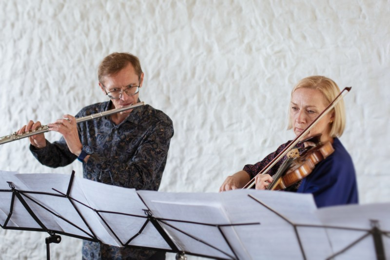

# DUOS 

[EST](duos.md)

[TICKETS](https://fienta.com/et/duod-i)

The series "DUOS" is curated by Tarmo Johannes and features music for flute and one other performer. Throughout the season, Tarmo Johannes will collaborate with four outstanding musicians: Merje Roomere (violin), Fie Schouten (bass clarinet, Netherlands), Iris Oja (voice), Dario Calderone (double bass, Nertherlands/Italy) and Gunnhildur Einarsdottir (harp, Iceland/Germany).

The concerts are held in collaboration with the Estonian Centre of Contemporary Music at the ECCM hall and offer carefully selected contemporary chamber music performed at a high level.

Supported by: Cultural Endownment of Estonia, Estonian Authors' Society

 

## Concerts

### COMING

**March 7, 2026 DUOD V**  
**Tallinn College of Music and Ballet** (Pärnu r. 59, Tallinn), large chamber hall
**Tarmo Johannes** (flute) - **Gunnhildur Einarsdóttir** (harp, Iceland)

{: style="width:400px"}

Program:

**Salvatore Sciarrino** - "Fauno che fischia a un merlo" (1980) for flute and harp 
**Luciano Berio** - *Sequenza II* (1963) for harp  
**Gudmundur Steinn Gunnarson** -  new work for flute and harp (**esiettekanne**) 
**Ivan Fedele** - "Imaginery Skylines" (1998) for flute and harp 
**Toivo Tulev** -  "Dawn, almost Dawn" (2021) for *mansur ney*, version for bass flute (**permière of the version**) 
**Toru Takemitsu** - "Toward the Sea III" (1989) for alto flute and harp 
 

### PAST

All concerts take place in the hall of ECCM (Pühavimu 9, Tallinn)

**Sa 26.10.24,  7 PM DUOS I**  
**Tarmo Johannes** (flute) - **Merje Roomere** (violin)

{: style="width:400px"}

The concert is dedicated to the legendary Italian duo **Annamaria Morini** (1950-2016) -  **Enzo Porta** (1931-2020), for whom all of the duo pieces in the program  are written

Program:

**Franco Donatoni** -  "Ciglio II" (1993) for flute and violin  
**Tristan Murail** -  "Unaswered questions" (1995) for solo flute  
**Stefano Gervasoni** - "Due voci" (1991) for flute and violin  
**Tatjana Kozlova-Johannes**  - "Lovesong" (2010) for flute and violin  
**Kaija Saariaho** -  "Nocturne" (1994)  for solo violin 
**Oscar Bianchi** - "De Rerum Natura" (2001) for flute and violin  

 

**Sa 23.11.24,  7 PM DUOS II**  
**Tarmo Johannes** (flute) - **Fie Schouten** (bass clarinet, Neatherlands)

{: style="width:400px"}

The concert is dedicated to the teachers of Tarmo and Fie **Harrie Starreveld** ja **Harry Sparnaay**. 

Program: 

**Giacinto Scelsi **(1905-1988)  "Ko Lho" (1966) for flute and clarinet  
**Betsy Jolas** (1926) "Lovemusic" (2005) for flute and bass clarinet  
**Helena Tulve** (1972) "Feathers Falling" (2024)  for solo bass flute  
**Emre Dündar** (1972) "Uptalk" (2021) for bass flute and bass clarinet  
**Guus Janssen** (1951) "...van horen zingen..." (2020) for bassethorn  
**Fabio Nieder** (1957) "Duale B" (1990) for alto/bass flute and bassethorn/bass clarinet

 

**22.02.2025 DUOD III**  
**Tarmo Johannes** (flute) - **Iris Oja** (voice)

{: style="width:400px"}

<small>Screen snap from the video of "etching.ashes"</small>

Program: 

**Tatjana Kozlova-Johannes** - II mvt. from chamber opera "etching.ashes" (2022) for flute and voice 
**Georges Aperghis (1945)** -  "5 Calme-Plats: No 2" (1992) for solo voice 
**Age Veeroos** - "Enesekaotus" (2002)  for alto flute and mezzosoprano 
**Edith Canat de Chizy**  - "Litanie" (1982) for alto flute and mezzosoprano 
**Salvatore Sciarrino** - "Immagine Fenicia" (1996/2000) for amplified flute 
**Beat Furrer** -  "auf tönernen füssen" (2001) for amplified flute and voice 

  

**Sa April 12, 2025,   at 8 PM   DUOD IV**  
**Tarmo Johannes** (flute) - **Dario Calderone** (double bass, Netherlands/Italy)

{: style="width:400px"}

Kava: 

**Bernhard Lang** (1957)  - "DW22. Winterlicht" (2010) for bass flute and double bass. 1st movement 
**Age Veeroos** (1973)  -  "Haav" ("Wound") for solo quartertone flute (2025, **première**) 
**Simon Steen-Andersen** (1976)  - "Next to Beside Besides" #5 for amplified piccolo & #9 for double bass (2003/2009)  
**Dario Calderone** (1978) - "Aurale" (2017) for solo double bass 
**Annea Lockwood** (1939) - "Jitterbug" (2010) for instruments and 6-channel tape 

  

## Tickets

Full 15€ reduced 10 €

Music City youth ticket 5 € 

... at [Fienta](https://fienta.com/et/duod-iv) or on spot.
 

 

## Links

[III Facebook](https://www.facebook.com/events/1131441811761710)

[II Facebook](https://www.facebook.com/events/3258095860989034)

[I Facebook](https://www.facebook.com/events/3258095860989034)
