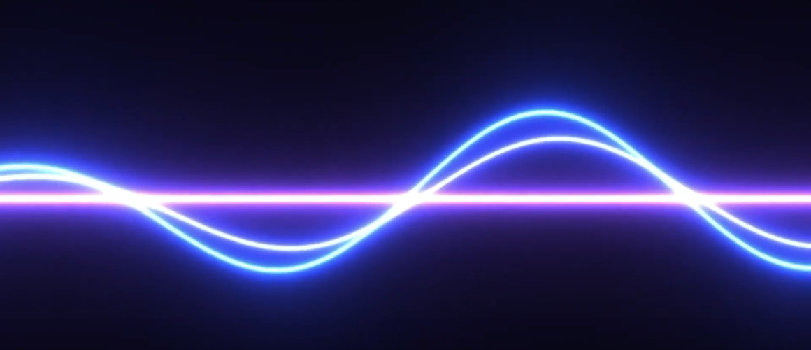
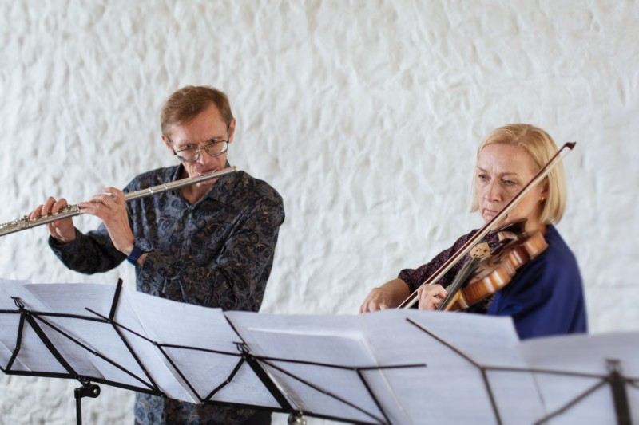
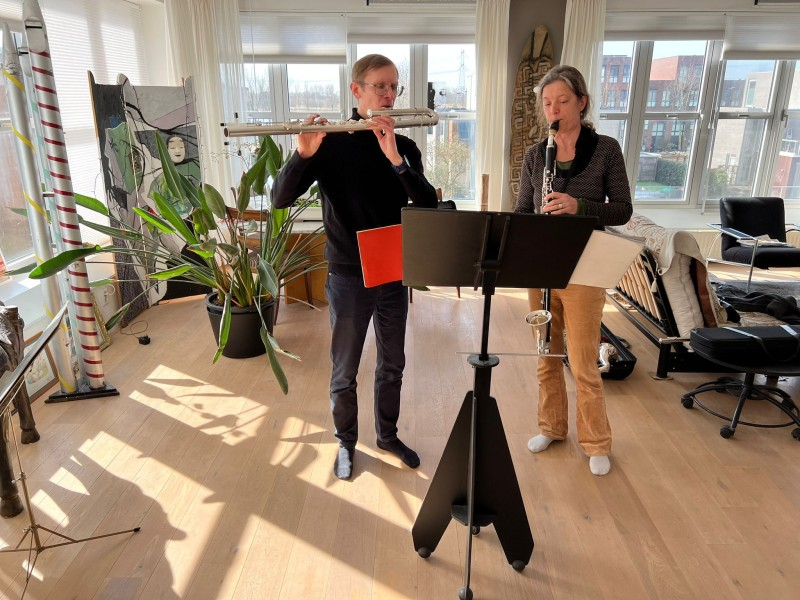
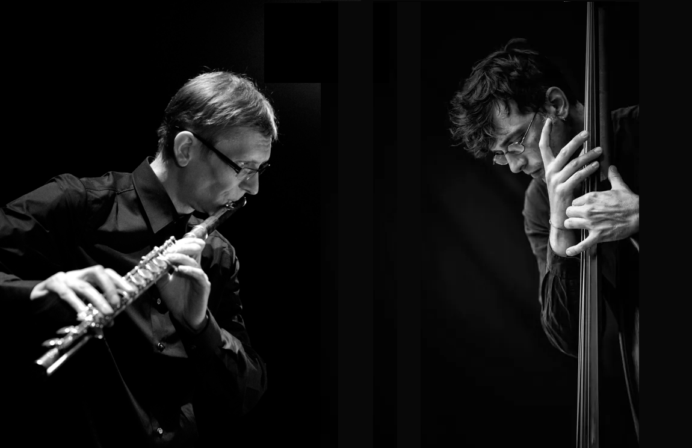
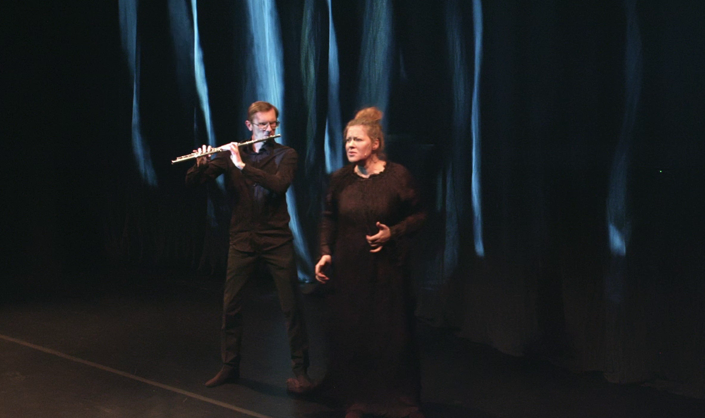

# DUOD 

[ENG](duos-eng.md)

[PILETID](https://fienta.com/et/duod-i)

"DUOD" on Tarmo Johannese kureeritud sari muusikast flöödile ja veel ühele esitajale. Tarmo Johannese partneriteks on hooaja jooksul neli suurepärast interpreeti - Merje Roomere (viiul), Fie
Schouten (bassklarnet, Holland), Iris Oja (hääl), Gunnhildur Einarsdottir (harf, Island/Saksamaa).

Kontserdid toimuvad koostöös Eesti Nüüdismuusika Keskusega ENMK saalis ning pakuvad kuulamiseks hoolega valitud tänapäevast kammermuusikat kõrgetasemelises esituses

Toetajad: Eesti Kultuurkapital, Eesti Autorite Ühing

 

## Kontserdid

Kõik kontserdid toimuvad Eesti Nüüdismuusika Keskuse saalis (Pühavimu tn 9, Tallinn)

### Tulekul

**September 2026 DUOD V** 
**Tarmo Johannes** (flööt) - **Gunnhildur Einarsdóttir** (harf, Island/Saksamaa) 

Kavas: 

**Ivan Fedele** - "Imaginery Skylines" (1998) flöödile ja harfile 
**Salvatore Sciarrino** - "Fauno che fischia a un merlo" (1980) flöödile ja harfile 
**Kaija Saariaho** - "Tocar" (2010/2014) versioon flöödile ja harfile  
**Toru Takemitsu** - "Toward the Sea III" altflöödile ja harfile  

### Möödunud 

**L 26.10.24 kl 29 DUOD I**  
**Tarmo Johannes** (flööt) - **Merje Roomere** (viiul) 

{: style="width:400px"}

<small>Foto: Kris Moor</small>

Kontsert on pühendatud legendaarsele flööt-viiul duole **Annamaria Morini** (1950-2016) -  **Enzo Porta** (1931-2020), kellele on kirjutatud kõik kavas olevad duo-teosed.

Kavas:  

**Franco Donatoni** -  "Ciglio II" (1993) flöödile ja viiulile  
**Tristan Murail** -  "Unanswered questions" (1995) sooloflöödile  
**Stefano Gervasoni** - "Due voci" (1991) flöödile ja viiulile  
**Tatjana Kozlova-Johannes**  - "Lovesong" (2010) flöödile ja viiulile  
**Kaija Saariaho** -  "Nocturne" (1994)  sooloviiulile  
**Oscar Bianchi** - "De Rerum Natura" (2001) flöödile ja viiulile  

 

**L 23.11.24 kl 19 DUOD II**  
**Tarmo Johannes** (flööt) - **Fie Schouten** (bassklarnet, Holland)

{: style="width:400px"}

Kontsert on pühendatud Tarmo ja Fie õpetajatele **Harrie Starreveld** ja **Harry Sparnaay**. 

Kavas: 

**Giacinto Scelsi **(1905-1988)  "Ko Lho" (1966) flöödile ja klarnetile    
**Betsy Jolas** (1926) "Lovemusic" (2005) flöödile ja bassklarentile  
**Helena Tulve** (1972) "Feathers Falling" (2024)  bassflöödile  
**Emre Dündar** (1972) "Uptalk" (2021) bassflöödile ja bassklarnetile  
**Guus Janssen** (1951) "...van horen zingen..." (2020) bassethornile  
**Fabio Nieder** (1957) "Duale B" (1990) alt-/bassflöödile ja bassethornile/bassklarnetile

 

**12. aprill 2025  kl 20(!) DUOD IV**  
**Tarmo Johannes** (flööt) - **Dario Calderone** (kontrabass, Holland/Itaalia)

{: style="width:400px"}

Kava: 

**Bernhard Lang** (1957)  - "DW22. Winterlicht" (2010) bassflöödile ja kontrabassile. I osa 
**Age Veeroos** (1973)  -  "Haav" veerandtoonflöödile (2025, esiettekanne) 
**Simon Steen-Andersen** (1976)  - "Next to Beside Besides" #5 võimendatud pikolole & #9 kontrabassile (2003/2009)  
**Dario Calderone** (1978) - "Aurale" (2017) kontrabassile 
**Annea Lockwood** (1939) - "Jitterbug" (2010) instrumentidele ja fonogrammile 

  
 

**22. veebruar 2025 DUOD III**  
**Tarmo Johannes** (flööt) - **Iris Oja** (hääl)

{: style="width:400px"}

<small>Kuvatõmmis "söövitab.tuhk" videost</small>

Kavas: 

**Tatjana Kozlova-Johannes** - II osa kammerooperist "söövitab.tuhk" (2022) flöödile ja häälele 
**Georges Aperghis (1945)** -  "5 Calme-Plats: No 2" (1992) soolohäälele 
**Age Veeroos** - "Enesekaotus" (2002) altflöödile ja mezzosopranile 
**Edith Canat de Chizy**  - "Litanie" (1982) altflöödile ja mezzosopranile 
**Salvatore Sciarrino** - "Immagine Fenicia" (1996/2000) võimendatud flöödile 
**Beat Furrer** -  "auf tönernen füssen" (2001) võimendatud flöödile ja häälele 

  

## Piletid

Täispilet 15€ sooudspilet 10 €

muusikalinna noortepilet 5 € 

Piletid [Fientast](https://fienta.com/et/duod-iv) või kohapeal.
 

 

## Viited

[IV Facebook](https://www.facebook.com/events/525554007318293)

[III Facebook](https://www.facebook.com/events/1131441811761710)

[II Facebook](https://www.facebook.com/events/3258095860989034)

[I Facebook](https://www.facebook.com/events/3258095860989034)