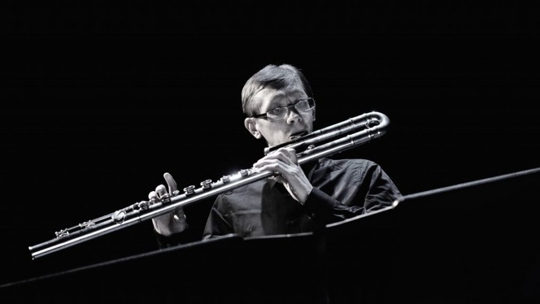

# Tarmo Johannes

[Bio](bio.md)

## Music

[DUOS](duos.md)

[Ensemble U:](https://www.uuu.ee)

[Ensemble of Estonian Electronic Music Society](https://estelmus.com/)

[Solo projects](solo.md)

 

## Software

[vClick](https://tarmoj.github.io/vclick/) - wirefree clicktrack system.

[Digisolf](https://otsakool.edu.ee/digisolf/) - ear training exercises

[H5P Solfege](https://github.com/tarmoj/h5p-solfege) - content types for musical dictations and more for e-koolikott. See about [creating exercises](https://github.com/tarmoj/h5p-solfege/blob/main/documentation/creating-exercises.md).

[Harjutsed muusikateooriaks](https://tarmoj.github.io/komp/index.html) (Autogenerating music theory exserciises)

All [gihtub repositories](https://github.com/tarmoj/)

 

## Articles, radio programs

 

## Other

[Youtube channel](https://www.youtube.com/channel/UCqa-tIeWxjcDd_207hPY95Q)

Videos of different interactive works in [vimeo](https://vimeo.com/user6332949/videos)	

Old [homepage](http://tarmo.uuu.ee/index_vana.html)		

