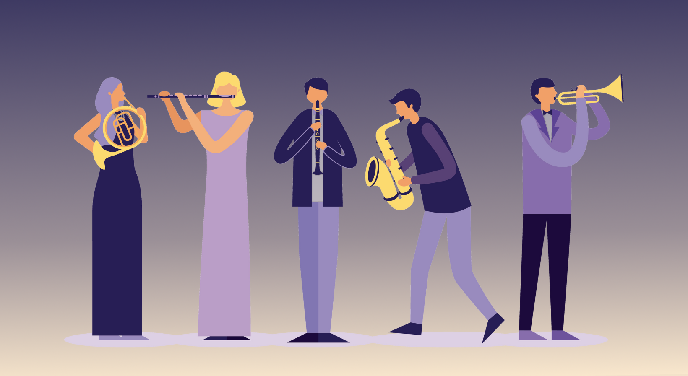
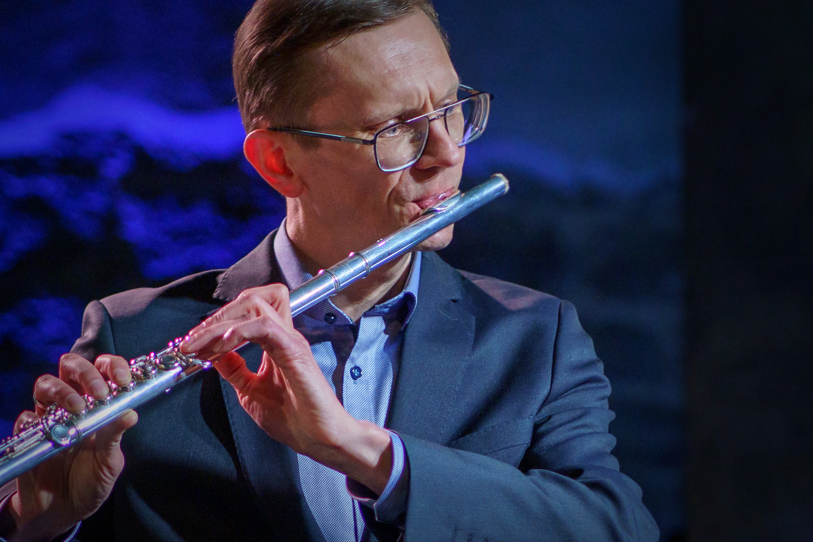

# Koosmänguklubi

 
<small><small><a href="http://www.freepik.com">Based on image by gstudioimagen / Freepik</a></small></small>

Registreerimine:  [14.02.26](https://forms.gle/JqmPk7925Gj4ptcr8) [21.02.26](https://forms.gle/MS6irG9qyvmEzy1f7) 

Kas pole nii, et suurim rõõm muusikast on seda ühes koos mängides? 

Kas oled õppinud või õppimas mõnda pilli ja sooviksid, et sul oleks koht ja inimesed, kellega koos musitseerida?
 
<h4>MIS? KELLELE?</h4>

**KOOSMÄNGUKLUBI** on võimalus mängida üheskoos. See on mõeldud eelkõige täiskasvanutest amatöörmuusikutele, kuid teretulnud on kõik, kel huvi. 

 *NB! Kahjuks ei ole toimumiskohas klaverit ja osaleda saab ainult nende pillidega, mida osaleja saab ise kohale tuua.*

#### KES?

Klubi tegevust korraldab flöödimängija ja pedagoog **[Tarmo Johannes](bio.md)**, kes aitab leida sobivat repertuaari ja mängib kõigis ansamblites  kaasa. 

#### KUIDAS?

Koos mängimiseks on järgnevad võimalused: 

1) **improvisatsiooniansambel**. Selleks, et muusikat teha, on vaja väga vähe. Osaleda võib mistahes pilli või  häälega, mistahes ettevalmistusega. Mängitakse lihtsatele reeglitele toetuvaid vabasid improvisatsioone (so ei ole džässi vm stiili põhised). Eesmärk on midagi üheskoos luua ja õppida ükstest kuulama ja mõistma ka ilma sõnadeta. 

2)  **klassikalise muusika ansambel**  Mängitakse klassikalise muusika repertuaari, vanamuusikast 20. sajandini. Repertuaari valitakse vastavalt osalejate huvile, võimetele ja koosseisule nii, et harjutamiseks ei peaks liiga palju vaeva kulutama. 

Huvi korral  võtke ühendust (e-mail allpool) ja  andke teada, mis pilli mängite, milline muusika teile meeldib, milline on teie muusikaline ettevalmistus ning kas soovite osaleda improvisatsiooni-, klassikalise muusika ansamblis või mõlemas.
  
  
Klubi on alles kujunemismisjärgus, esimene kohtumine toimus L 31.01.26.
  
#### MILLAL ja KUS?

Koosmänguklubi toimub laupäeviti [GUITARIUM](https://guitarium.ee/)  ruumides, Planeedi 5, Tallinn.  
Aitäh, Guitarium! 
Hetkel on plaanis kolm koosseisu:
* 11.00-12.00 **Ladusalt noodist lugejad** (lõpetanud muusikakooli, keskastme, kõrgkooli vms. Lood ei ole iseenesest rasked)
* 12.30-13.30 **Improvisatsiooniansambel** (sobib kõikidele, tase pole määrav)
* 14.00-15.00 **Lihtsate lugude ansambel** (õppinud mõned aastad või omal käel)

Ühe ansamblimängusessiooni kestus on  60 minutit. 

#### TASU?

 Maksumus: 15 € kord (inimese kohta).  Tasuda saaab [pangaülekandega](https://www.lhv.ee/et/al/?KHSPCPvM) või [Paypal](https://paypal.me/tarmojohannes) maksena või kohapeal.
 
 
 <h4>NOODID</h4>
 
 Noodid asuvad [siin](https://drive.google.com/drive/folders/1ycE4isFlomQPX71eoZ0-a_b7zpTbljC5?usp=drive_link)  
  Uue nädala noodid ilmuvad vastava kuupäeva kausta kolmapäeva õhtuks.
 
#### KONTAKT
 
Huvi ja küsimuste korral [kirjutage](mailto:koosmanguklubi@gmail.com )   julgelt! 
 
 [Facebook](https://www.facebook.com/profile.php?id=61586308351830)
 
  
 Tarmo Johannes
  
