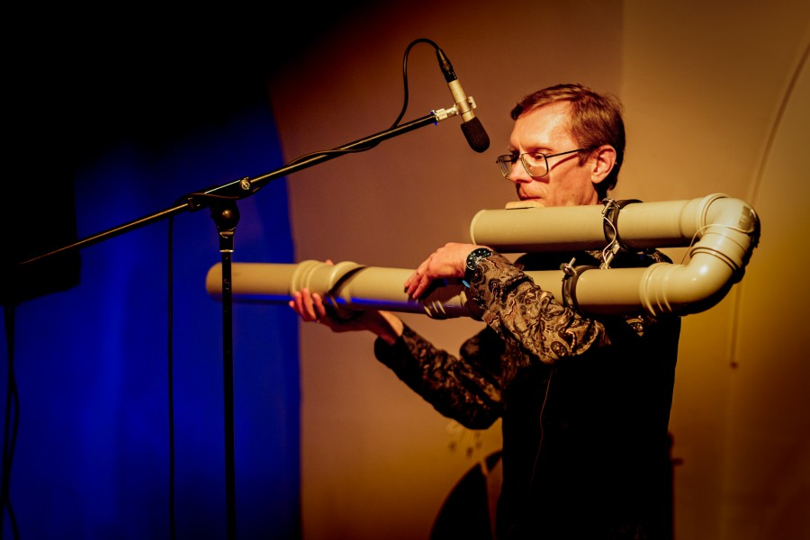

# Dark-warm 

[EST](tumesoe.md)

[Support "Tumesoe" at Hooandja!](https://www.hooandja.ee/projekt/tumesoe)

„Tumesoe” ("Dark-warm") is an original work by Tarmo Johannes, featuring a large self built flute made from sewer pipes.

{: style="width:400px"}

<small>Photo: Rene Jakobson</small>

Naturally "Dark-warm"  refers to the low and particularly soft sound of that instrument, from which a carefully developed computer program starts to build up layer by layer a drone like piece, something soft and uniquely beautiful. Or perhaps it's more like a sofa of sounds, into which the listener can comfortably sink and let themselves be carried away elsewhere, eyes closed. 

The concerts take place in the suburban concert venues of summer time Tallinn: at the Von Glehn Theatre in Nõmme, the Cultural Center Kaja in Mustamäe, the Pirita Acitivies Centre, and the courtyard of the Lasnamäe Pavilion of the Tallinn Art Hall.

The tour happens at a time when much of the cultural life tends to escape the city. Nevertheless, the city is not empty, and "Tumesoe" offers a pleasant and likely memorable pastime, especially for many who live nearby.

The piece, or rather its different parts, has been heard in very different contexts and has always been well received: its premiere at the International Csound Conference in Cagli (2019, Italy), as a fragment in Thomas Desi's opera "Tarkovsky's 8. film" in Vienna, Tallinn, and Tartu (2020), at the alternative club event Konsum – ULM (2021), and at festivals such as Sound Plasma and Üle Heli (2023). An extended, evening-length version of the piece will be performed for the first time in the summer of 2024.

Additionally, the concert will feature other "normal" flutes, natural horn, and electronics.

Flutes, concept, natural horn, software: Tarmo Johannes 
Duration: ca 45..50 minutes 
Date: July 1.-4, 2024 
Organizer: MTÜ Vergin Danuques, in colloaboration with Estonian Centre of Contemporary Music 
Contact: Tarmo Johannes trmjhnns@gmail.com 

 

## Concerts

**Mo 1.07, 8 PM** Von Glehni Teater, (Pärnu mnt 326)

**Tu 2.07, 8 PM** Kaja Kultuurikeskus, white hall(E. Vilde tee 118)
 
**We 3.07, 8 PM** Pirita Vaba Aja Keskus (Merivälja tee 3)

**Thu 4.07, 7 PM** Lasnamäe Pavilion of the Tallinn Art Hall*  (Jaan Koorti 24)
      * at 6 PM guided tour by the exhibition

 

## Tickets

Single concert: 15/10 €

Tallinn Musical City youth ticket: 5 € 

Fan's ticket (entrance to all concerts): 25 €

At [Fienta](https://fienta.com/et/tarmo-johannes-tumesoe-tallinna-tuur) or on spot.
 

 

## Links

[Facebook](https://www.facebook.com/profile.php?id=61558474935668)

[Support "Tumesoe" at Hooandja!](https://www.hooandja.ee/projekt/tumesoe)

Teaser:
<iframe width="853" height="480" src="https://www.youtube.com/embed/enNf9Z0eYno" title="&quot;Tumesoe&quot; (Dark-warm) teaser" frameborder="0" allow="accelerometer; autoplay; clipboard-write; encrypted-media; gyroscope; picture-in-picture; web-share" referrerpolicy="strict-origin-when-cross-origin" allowfullscreen></iframe>

Video (I movement, the première in Italy, 2019):
<iframe width="853" height="480" src="https://www.youtube.com/embed/cTClzfLD4r0" title="CONCERT I (4) - Dark-warm - TARMO JOHANNES" frameborder="0" allow="accelerometer; autoplay; clipboard-write; encrypted-media; gyroscope; picture-in-picture; web-share" allowfullscreen></iframe>
