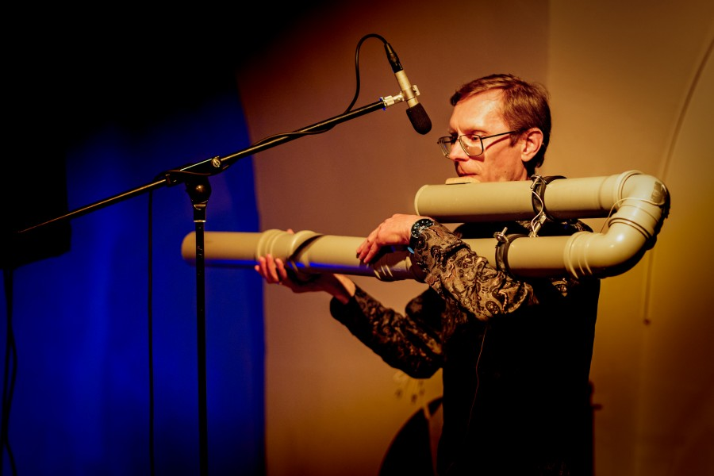

# Tumesoe 

[ENG](tumesoe-eng.md)

["Tumesoe" album Bandcampis](https://tarmojohannes.bandcamp.com/album/tumesoe-dark-warm)

CD tellimiseks saatke kiri: t r m j h n n s (ät) g m a i l (punkt) c o m 

„Tumesoe” on Tarmo Johannese originaalne teos, kus kesksel kohal on kanalisatsioonitorudest ise ehitatud hiiglaslik flööt.

{: style="width:400px"}

<small>Foto: Rene Jakobson</small>

Loomulikult viitabki „Tumesoe” tolle pilli madalale ja eriliselt pehmele kõlale, millest hoolikalt just selle teose jaoks välja töötatud  arvutiprogramm hakkab tasapisi punuma helikangast,  midagi pehmet ja omal moel kaunist. Või on see hoopis helide sohva, millesse kuulaja võib mugavasti vajuda ja lasta end, silmad kinni, mujale kanda.  

Kontserdid kõlavad suvise Tallinna äärelinna kontserdipaikades: Von Glehni Teatris Nõmmel, Kultuurikeskuses Kaja Mustamäel, Pirita Vaba Aja Keskuses, Tallinna Kunstihoone Lasnamäe paviljoni siseõues. 
Tuur leab aset ajal, kui pea kogu kultuurielu kipub pigem linnast pagema. Ometigi – linn ei ole tühi ning „Tumesoe” pakub meeldivat ja usutavasti meeldejäävat äraolemist, pealegi veel paljude jaoks elukoha lähedal.

Teos, õigemini selle erinevad osad,  on kõlanud väga erinevates kontekstides ning võetud alati hästi vastu: esiettekanne rahvusvahelisel Csoundi konvertsil Caglis (2019, Itaalia), fragmendina Thomas Desi etenduses „Tarkovski 8.film” Viinis, Tallinnas ja Tartus (2020), alternatiivsel klubiüritusel Konsum – ULM (2021), festivalidel Sound Plasma ja Üle Heli (2023). Täiendatud, õhtut täitvas versioonis tuleb teos 2024. suvel ettekandele esimest korda.

Ühtlasi on kontserdil kasutusel ka teised, “normaalsed” flöödid, naturaalsarv ja elektroonika.

Flöödid, idee ja teostus: Tarmo Johannes 
Kestus: u 45..50 minutit 
Toimumisaeg: 1.-4. juuli 2024 
Korraldaja: MTÜ Vergin Danuques, koostöös Eesti Nüüdismuusika Keskusega 
Kontakt: Tarmo Johannes trmjhnns@gmail.com 

 

## Kontserdid

**E 1.07 kl 20** Von Glehni Teater, (Pärnu mnt 326)

**T 2.07 kl 20** Kaja Kultuurikeskuse valge saal (E. Vilde tee 118)
 
**K 3.07 kl 20** Pirita Vaba Aja Keskus (Merivälja tee 3)

**N 4.07 kl 19** Tallinna Kunstihoone Lasnamäe paviljoni siseõu*  (Jaan Koorti 24)
      * kl 18 giidituur näitusesaalis 

 

## Piletid

üks kontsert: 15/10 €

muusikalinna noortepilet 5 € 

fänni pilet (sissepääs kõikidele kontsertidele): 25 €

Piletid [Fientas](https://fienta.com/et/tarmo-johannes-tumesoe-tallinna-tuur) või kohapeal.
 <QR>

 

## Viited

[Facebook](https://www.facebook.com/profile.php?id=61558474935668)

["Tumesoe" album Bandcampis](https://tarmojohannes.bandcamp.com/album/tumesoe-dark-warm)

Teaser:
<iframe width="853" height="480" src="https://www.youtube.com/embed/enNf9Z0eYno" title="&quot;Tumesoe&quot; (Dark-warm) teaser" frameborder="0" allow="accelerometer; autoplay; clipboard-write; encrypted-media; gyroscope; picture-in-picture; web-share" referrerpolicy="strict-origin-when-cross-origin" allowfullscreen></iframe>

Video (I osa, esiettekanne, Itaalias):
<iframe width="853" height="480" src="https://www.youtube.com/embed/cTClzfLD4r0" title="CONCERT I (4) - Dark-warm - TARMO JOHANNES" frameborder="0" allow="accelerometer; autoplay; clipboard-write; encrypted-media; gyroscope; picture-in-picture; web-share" allowfullscreen></iframe>
